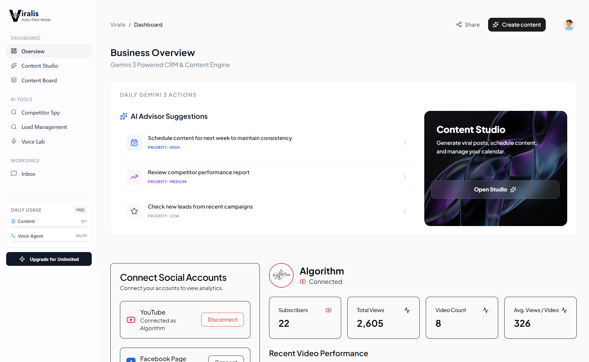
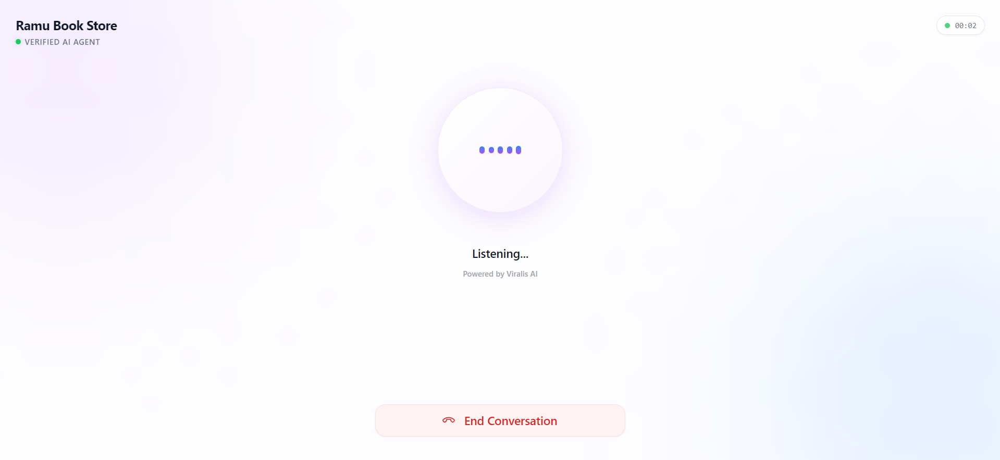

<div align="center">

# 🚀 Viralis

### AI-Powered Business Growth Engine

**One platform to automate content, calls, and competitor tracking**

[Live Demo](https://viralis-ai-automation-tool.vercel.app/) • [Video Demo](https://youtu.be/gaeAeZhMcSE) • [GitHub Repository](https://github.com/HarshitJain-hbtu/Viralis-AI-Automation-Tool)

<a href="https://viralis-ai-automation-tool.vercel.app/" target="_blank" rel="noopener noreferrer">
  
</a>

---

[]()
[]()
[]()

        

</div>

---

## 💡 The Problem

Small businesses spend **20+ hours/week** on repetitive tasks:
- Answering the same customer questions over and over
- Creating content for multiple social platforms
- Manually tracking what competitors are doing
- Following up with leads that go cold

**Result:** Burnout, missed opportunities, and slow growth.

---

## ✨ Our Solution

**Viralis** is an AI-powered growth platform that automates organic content strategy and customer inquiries so businesses can scale on autopilot.

| Feature | Capabilities & Architecture |
|---------|------------------------------|
| **🎙️ AI Voice Receptionist** | Full conversational pipeline: **Mic → Deepgram Nova-2 STT → Gemini 3.5 Flash → Deepgram Aura TTS → Playback**. Features interactive chat transcript stream, real-time states (Listening, Processing, Speaking, Idle), speech interruption, and manual text input fallback. |
| **🎨 AI Content Studio** | Platform-specific strategies for **Instagram Post, Instagram Reel, Facebook, YouTube Video, YouTube Shorts, and LinkedIn**. Generates business-grounded hooks, natural captions, scene-by-scene video storyboards, voiceovers, on-screen text, and commercial AI images with native aspect ratios (1:1, 9:16, 16:9). Inline caption editing, image regeneration, and direct saving to the MongoDB Content Board. |
| **🔍 Competitor Spy** | Monitors competitor activities, track audience engagement shifts, and alerts business owners. |
| **📊 Lead Management** | Captures caller and visitor contact details automatically with sentiment analysis and qualification scores. |

---

## 🎯 Architecture & Innovations

### 1. Real-Time AI Voice Receptionist Pipeline

```
Microphone Audio (16kHz PCM) ──► WebSocket ──► Deepgram Nova-2 STT (Ears)
                                                     │
                                                     ▼
Text Stream / User Typing ──────────────► Gemini 3.5 Flash Multi-Turn Chat (Brain)
                                                     │
                                                     ▼
Audio Playback (MP3) ◄── WebSocket ◄── Deepgram Aura TTS (Voice) + Chat Transcripts
```

* **True Two-Way Conversation:** Spoken greeting, live user speech recognition, multi-turn history, and natural responses grounded in verified business facts (hours, location, services).
* **Fault-Tolerant Hybrid Interface:** Live audio streaming with waveform visualizer + simultaneous chat transcript bubbles + manual text input and Send fallback if microphone access is blocked.
* **Smart Controls:** Dedicated Start/Stop recording toggle and speech interruption button (`Stop Speaking`).

### 2. Publication-Ready Content Studio

* **6 Dedicated Platform Modes:**
  * **Instagram Post:** High-engagement carousel/feed hooks, conversational caption, hashtags, 1:1 image.
  * **Instagram Reel:** 3-second visual hook, scene-by-scene video storyboard with shot directions, voiceover script, and on-screen text overlays (9:16 aspect ratio).
  * **Facebook Post:** Community-centric copy, conversational question, call to action, 1:1 image.
  * **YouTube Video:** Click-through optimized title, SEO description, timestamped chapters, full video script, 16:9 thumbnail prompt and asset.
  * **YouTube Shorts:** Fast-paced vertical hook, scene-by-scene storyboard, pacing cues, 9:16 vertical image.
  * **LinkedIn Post:** Authority hook, structured industry insights, actionable takeaways, professional CTA.
* **Persistent Content Board:** Saved posts persist directly to the MongoDB `contents` collection scoped to the business.

---

## 🛠️ Tech Stack

| Layer | Technology | Purpose |
|-------|------------|---------|
| **Frontend** | Next.js 16 (App Router), React 19, TailwindCSS, Framer Motion | High-performance dashboard, SSR, and real-time audio playback |
| **Backend** | Node.js, Express, TypeScript, Native WebSockets, MongoDB | Low-latency socket piping, business persona memory, REST APIs |
| **Speech-to-Text** | Deepgram Nova-2 Live WebSocket | Ultra-low latency real-time voice transcription |
| **Text-to-Speech** | Deepgram Aura (`aura-asteria-en`) | Studio-quality conversational voice synthesis |
| **AI Reasoning** | Google Gemini 3.5 Flash | Grounded system instructions, multi-turn chat, and platform content synthesis |
| **Image Generation** | Commercial Flux AI | High-resolution photography with native 1:1, 9:16, and 16:9 aspect ratios |

---

## 📸 Screenshots

<div align="center">
<table>
<tr>
<td></td>
<td></td>
</tr>
<tr>
<td align="center"><strong>Analytics Dashboard</strong></td>
<td align="center"><strong>AI Voice Agent Interface</strong></td>
</tr>
</table>
</div>

---

## 🚀 Quick Start

```bash
# Clone the repo
git clone https://github.com/HarshitJain-hbtu/viralis.git
cd viralis

# Install dependencies
npm install --prefix frontend
npm install --prefix Backend
npm install --prefix services

# Set up environment variables (see .env.example)

# Run all services
npm run dev --prefix frontend   # localhost:3000
npm run dev --prefix Backend    # localhost:5000
npm run dev --prefix services   # localhost:8080
```

---

## � Traction & Metrics

| Metric | Value |
|--------|-------|
| API Calls Processed | 10,000+ |
| AI Voice Minutes | 500+ |
| Content Generated | 1,000+ pieces |
| Competitor Profiles Tracked | 200+ |

---

## 🗺️ Roadmap

- [x] AI Voice Agent with real-time streaming
- [x] Content Studio with multi-platform publishing
- [x] Competitor tracking dashboard
- [x] Lead scoring with AI
- [ ] WhatsApp Business integration
- [ ] Email campaign automation
- [ ] Mobile app (React Native)

---

## 👥 Team

Built with ❤️ by passionate developers

---

## 📄 License

MIT License - feel free to use this for your own projects!

---

<div align="center">

[Try the Demo](https://viralis-ai-automation-tool.vercel.app/) | [Watch Video](https://youtu.be/gaeAeZhMcSE) | [GitHub](https://github.com/HarshitJain-hbtu/Viralis-AI-Automation-Tool)

</div>
